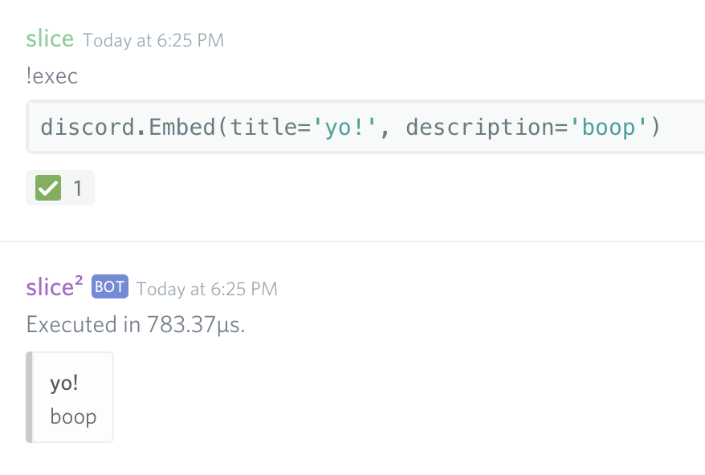
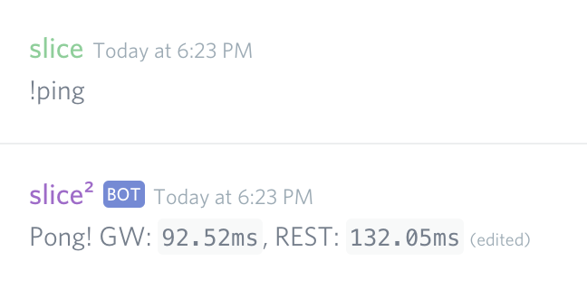
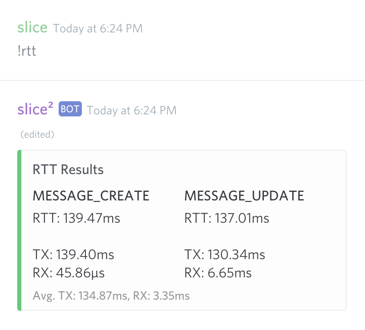

.. currentmodule: lifesaver

Built-in Cogs
=============

Admin
-----

Errors
------

.. _exec_cog:

Exec
----

.. autoclass:: lifesaver.bot.exts.exec.Exec
    :members:

Evaluating Code
~~~~~~~~~~~~~~~

Simple expressions and code blocks alike can be evaluated with the cog.

Backticks are optional. The cog recognizes Markdown markup for inline code
or code blocks (optionally with syntax highlighting), and automatically removes
them when processing the code.

Implicit Return
^^^^^^^^^^^^^^^

The Exec cog automatically tries to prepend a ``return`` keyword to the last
line of your code. If this makes the code invalid, your original code is used
instead. This value will be echoed back to you in the same channel.

Representation
^^^^^^^^^^^^^^

``repr`` is used to represent return values as a string. If a string is
returned, then the string is echoed (instead of a ``repr`` of it), with a
"(string)" notice in the preamble.

Execution Environment
^^^^^^^^^^^^^^^^^^^^^

The following modules are automatically available without having to ``import``
them:

* ``discord``
* ``asyncio``

The following values are exposed:

* ``ctx``: The :class:`lifesaver.bot.Context` (or custom context class)
  instance for this particular command invocation.
* ``cog``: The actual :class:`Exec` cog itself.

There are also plenty of shorthands:

+-------------------------------+----------------------------------+
|           Shorthand           |            Actual Value          |
+-------------------------------+----------------------------------+
| ``bot``                       | ``ctx.bot``                      |
+-------------------------------+----------------------------------+
| ``msg``                       | ``ctx.message``                  |
+-------------------------------+----------------------------------+
| ``guild``                     | ``ctx.guild``                    |
+-------------------------------+----------------------------------+
| ``channel``                   | ``ctx.channel``                  |
+-------------------------------+----------------------------------+
| ``me``                        | ``ctx.message.author``           |
+-------------------------------+----------------------------------+
| ``commands``                  | ``discord.ext.commands``         |
+-------------------------------+----------------------------------+
| ``command``                   | ``discord.ext.commands.command`` |
+-------------------------------+----------------------------------+
| ``group``                     | ``discord.ext.commands.group``   |
+-------------------------------+----------------------------------+
| ``_get``                      | ``discord.utils.get``            |
+-------------------------------+----------------------------------+
| ``_find``                     | ``discord.utils.find``           |
+-------------------------------+----------------------------------+

Grabbers
""""""""

Various "grabber" functions are also exposed, which act as a shortcut function
to fetch a model (like a user or channel) from the current guild or bot state.

.. function:: _g(guild_id)

    Fetches a guild using ``bot.get_guild``.

.. function:: _u(user_id)

    Fetches a user using ``bot.get_user``.

.. function:: _c(channel_id)

    Fetches a channel from the current guild using ``guild.get_channel``.

.. function:: _m(specifier)

    Fetches a member from the current guild. The specifier matches the
    following:

    * ``int``: User ID
    * ``str``: DiscordTag (username#discriminator)
    * ``str``: ``user.display_name``
    * ``str``: ``user.name``

Automatic Sending
^^^^^^^^^^^^^^^^^

This behavior has been copied from `Jishaku <https://github.com/Gorialis/jishaku>`_.

When a :class:`discord.File` or :class:`discord.Embed` is returned, it is
automatically uploaded/sent, respectively. Any errors that occur when uploading
or sending are echoed.

Long-running Evaluations, a.k.a. ("Sessions")
^^^^^^^^^^^^^^^^^^^^^^^^^^^^^^^^^^^^^^^^^^^^^

All running code is spawned in a background task, called a "session".

When a session takes more than 3 seconds to evaluate, a reaction emoji
(using the ``exec.kill`` emoji) appears on your message. Reacting with this
emoji will kill the session, then react with the ``exec.cancelled`` emoji.

.. image:: images/exec_cog_kill.gif

All running sessions can be cancelled with the ``cancel`` subcommand of the
``exec`` command. This will immediately halt all running sessions.

Health
------

This cog comes with an included ``ping`` command:

RTT
~~~

A ``rtt`` command is also implemented, which measures REST API response times
and Gateway echo times for message creation (``MESSAGE_CREATE``) and message
editing (``MESSAGE_UPDATE``).

TX measures the amount of time it takes for the HTTP request to finish. RX
measures how long it takes for the Discord Gateway to echo the action back to
the bot. RTT is the sum of these two values.
