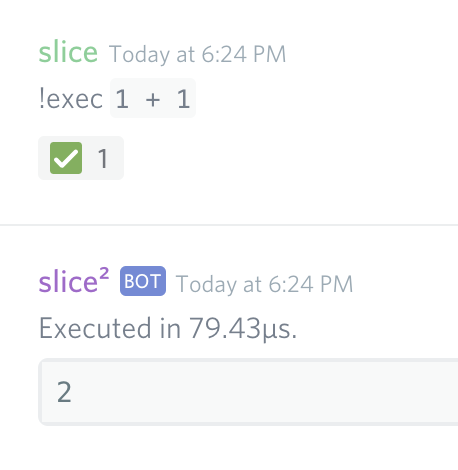
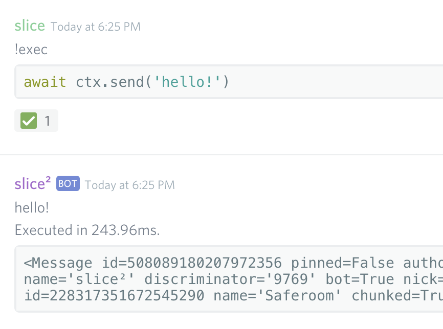

.. currentmodule:: lifesaver.bot

Getting Started
===============

Lifesaver is a framework/library for Discord.py 1.0.0. It includes useful logic
and cogs that help reduce boilerplate.

Installing
----------

For now, Lifesaver can only be installed directly from GitHub. Make sure you
have Git_ installed, or else the install will fail.

UNIX
~~~~

Depending on your Python installation, ``pip`` can point to Python 2 or 3.
Assuming it points to Python 2, this example uses ``pip3``.

.. code-block:: sh

    pip3 install -U git+https://github.com/slice/lifesaver

Windows
~~~~~~~

.. code-block:: sh

    py -3 -m pip install -U git+https://github.com/slice/lifesaver

Creating a Config File
----------------------

All configuration files use YAML_ for the sake of simplicity. Anchors are also
useful for the :ref:`global emoji table <global_emoji_table>`.

Enter an empty directory and create ``config.yml``. This is where your bot's
configuration file lives.

We'll specify a token for now::

    token: 'theQuiCK_b-Row-nFOxJ.U.MPsOV-ErtHElAzYdOG'

This is the bare minimum config file. Other attributes may be specified for
further customization -- see :class:`BotConfig`.

Invoking the CLI
----------------

Lifesaver includes a CLI module that automatically prepares a bot and starts it,
performing the following steps:

* uvloop_ is automatically used if available.
* Lifesaver looks for your config file at ``config.yml`` and loads it into a
  :class:`BotConfig` instance at runtime.
* The bot class (default or custom) is constructed and started.

With this CLI module, writing a ``run.py``, ``launcher.py``, or any other file
with a similar name and task should be unnecessary. It allows you to quickly get
started scaffolding new bots: you don't have to write launcher scripts.

To start the CLI, use the ``-m`` argument of the Python executable to launch
``lifesaver.cli``::

    python3 -m lifesaver.cli

Your bot should now be up and running with the default command prefix: ``!``.
To change the command prefix, modify the :attr:`BotConfig.command_prefix` value
in your config file.

Built-in Cogs
-------------

The CLI module automatically loads Lifesaver's :doc:`included extensions
<cogs>` upon startup.

Exec
~~~~

The Exec cog allows you to evaluate arbitrary Python code through Discord. Right
now, this command can only be ran by the owner of the bot.

Simple expressions work as expected:

Codeblocks work as well:

You might've noticed that the :class:`discord.Message` object was returned.
Implicit ``return`` keywords are automatically added to your code if the syntax
is valid after the change.

The cog also measures execution time, and is echoed back to you along with a
``repr`` of the result.

For a more comprehensive breakdown of the Exec cog, see the
:ref:`built-in cogs <exec_cog>` page.

.. _Git: https://git-scm.com/
.. _uvloop: https://uvloop.readthedocs.io/
.. _YAML: https://en.wikipedia.org/wiki/YAML
